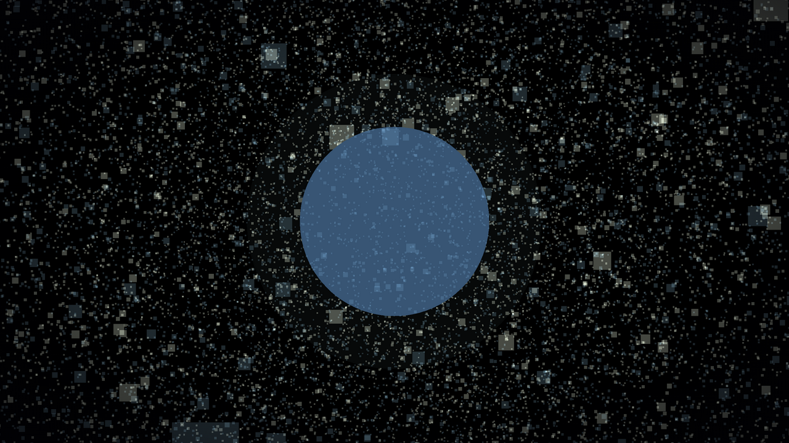
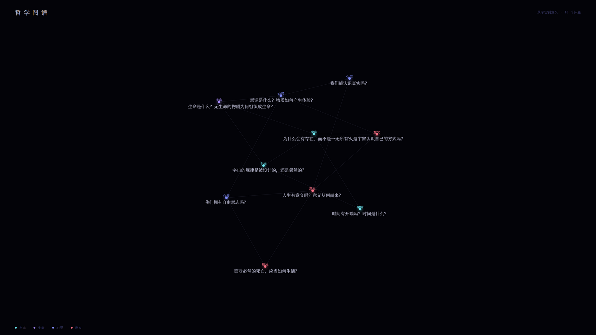
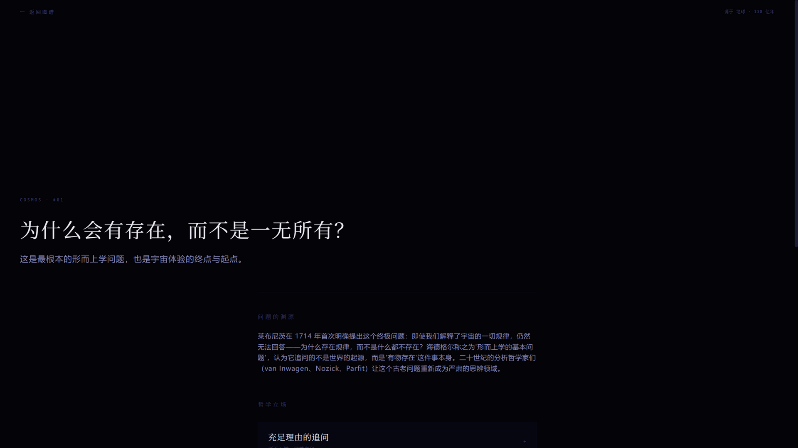

# COSMOS / 存在

[中文](#中文) | [English](#english)


-e0a80f)


---

## 中文

沉浸式哲学探索网站：从宇宙诞生的第一秒，一路走到人类意识与人生意义——在 138 亿年的演化叙事中，让终极哲学问题自然浮现。

> 不是哲学百科，而是「体验式哲学引路人」。

**在线体验：<https://cosmos-existence.vercel.app>**（界面为简体中文）

### 体验流

```text
黑暗（呼吸星光）→ 点击「开始」→ 宇宙演化六纪元（可拖动时间轴/切倍速）
→ 第一个哲学问题「为什么存在者存在，而非一无所有？」→ 哲学知识图谱
```

### 截图

| 宇宙演化 · 恒星纪元 | 问题揭晓 |
|:---:|:---:|
|  |  |

| 哲学知识图谱 `/explore` | 问题详情 `/question/[id]` |
|:---:|:---:|
|  |  |

### 特性

- **电影式宇宙演化**：奇点 → 暴胀 → 粒子 → 恒星 → 星系 → 地球，六纪元场景程序化生成（无任何预渲染视频），旁白字幕逐句淡入。
- **自适应字幕对比度**：奇点白炽等亮屏时段，字幕与时间轴自动切换为深色文字 + 白色光晕，暗屏时段保持浅色微光——任何画面文字均可读（`screenBrightness` 数据字段 + 亮度插值引擎驱动）。
- **科学准确的膨胀表现**：采用共动坐标系——粒子持有固定共动坐标，世界坐标 = 共动坐标 × 尺度因子 a(t)，展现「空间本身膨胀」而非「物质在静止空间中飞散」。
- **交互式对数时间轴**：从普朗克时间到今天的 138 亿年压缩为 0~1，拖动实时驱动宇宙状态；点击画面可切换播放倍速（1 → 2×）。
- **数据驱动的哲学内容**：10 个终极问题、48 个哲学立场、80+ 位代表人物（含生卒年）、80+ 处文献出处（以斯坦福哲学百科全书 SEP 等权威来源为口径），全部存放于 `src/data/`，一题一文件，新增/修改内容零 UI 改动。
- **自研 2D 力导向知识图谱**：`/explore` 页 Canvas 渲染 + DOM 可访问标签，支持拖拽节点、平移、缩放、按纪元着色；移动端自动退化为分类列表 + 迷你图谱。
- **立场对仗呈现**：每个立场下「论证 ↔ 反驳」并列展示，无评判性结论，保持哲学中立。
- **性能三档分级**：粒子数量/DPR 按 high/medium/low 三档自动适配，尊重 `prefers-reduced-motion`。
- **完整质量门禁**：`pnpm verify` = TypeScript 严格类型检查 + ESLint + 生产构建 + 数据引用完整性校验；另有 28 个纯函数单元测试（`pnpm test`）。
- **Lighthouse**（桌面端）：Performance **100** / Accessibility **95**。

### 环境要求

- [Node.js](https://nodejs.org/) ≥ 20.9.0（Next.js 16 要求）
- [pnpm](https://pnpm.io/) ≥ 12（仓库已声明 `packageManager: pnpm@12.3.4`，corepack 会自动启用）

### 安装

```bash
git clone <仓库地址>
cd cosmos-existence
pnpm install
pnpm dev          # http://localhost:3000
```

### 常用命令

| 命令 | 作用 |
|---|---|
| `pnpm dev` | 开发服务器（Turbopack） |
| `pnpm build` | 生产构建 |
| `pnpm start` | 运行生产构建 |
| `pnpm test` | 单元测试（node:test，28 用例，零额外测试依赖） |
| `pnpm typecheck` / `pnpm lint` | 类型检查 / ESLint |
| `pnpm validate:data` | 哲学数据引用完整性校验 |
| `pnpm verify` | 质量门禁 = typecheck + lint + build + 数据校验（**任何改动必须全绿**） |

### 环境变量

项目**开箱即用，无需任何环境变量**。唯一可选项：

```bash
LLM_API_KEY   # /api/llm 预留接口使用；该接口尚未接入真实模型，不配置不影响任何现有功能
```

参见 `.env.example`。

### 项目结构

```text
src/
├── app/
│   ├── page.tsx                # 首页：体验状态机（void → awakening → cosmos → question）
│   ├── explore/page.tsx        # 哲学知识图谱（桌面图谱 / 移动端列表+迷你图谱）
│   ├── question/[id]/page.tsx  # 问题详情页（SSG 静态生成）
│   └── api/llm/route.ts        # LLM 接口预留骨架
├── components/
│   ├── canvas/                 # React Three Fiber 三维层（六纪元场景、共动粒子云、相机运镜）
│   ├── timeline/               # 对数时间轴 UI
│   ├── philosophy/             # 图谱 / 立场卡片 / 论证面板
│   ├── home/                   # 开场与问题揭晓
│   └── ui/                     # 基础组件（按钮/排版/分割线）
├── data/                       # ★ 内容唯一事实来源：types.ts / cosmic-eras.ts / questions/（一题一文件）/ validators.ts
├── stores/                     # Zustand：体验阶段机 / 时间线 / 性能档位
├── hooks/                      # 性能探测 / reduced-motion / 时间轴拖动
└── lib/                        # 纯函数：宇宙学引擎 a(t)、粒子系统、文字对比度、力导向布局、视图变换（含单测）
docs/                           # 7 份设计与交接文档（PRD / 架构 / 数据模型 / 设计系统 / 路线图等）
```

### 架构要点

- **共动坐标系引擎**（`src/lib/cosmology.ts`）：时间线参数 t ∈ [0,1] 经对数映射定位纪元与进度，输出尺度因子 a(t)、相机参数；粒子云以 `group scale = a(t)` 整体缩放，实现物理正确的空间膨胀。
- **数据驱动**：`src/data/types.ts` 是全部内容类型的唯一事实来源；`validators.ts` 在 `pnpm verify` 中强制校验（立场数、论证/反驳成对、引用无悬空、order 连续等）。
- **模块边界**：`canvas/` 不读哲学数据（只消费 store）；`data/` 纯数据不依赖组件；`lib/` 纯函数无 React 依赖；流程控制只存在于 store。
- **首屏性能**：首页 void 阶段不加载 Canvas（`dynamic` + `ssr: false`），3D 资源点击「开始」后才加载。

### 部署

已部署于 Vercel（生产域名见顶部）。仓库自带 `vercel.json`：

```json
{ "framework": "nextjs", "buildCommand": "pnpm verify", "regions": ["hkg1"] }
```

即云端构建同时执行完整质量门禁。也可自托管：`pnpm build && pnpm start`。

### 开发路线

- [x] Phase 0~9：体验流 / 图谱 / 数据 / 部署 全部完成（见 `docs/ROADMAP.md`）
- [ ] 图谱拖拽后局部重松弛（当前为静态冻结布局）与按纪元分簇引力
- [ ] 运行时 FPS 动态降级（当前仅启动时探测档位）
- [ ] 移动端图谱交互预览、时间轴滑动手势
- [ ] 接入真实 LLM（`/api/llm` + RAG，数据与 `src/data/` 同源）

### 参与贡献

- 任何改动需通过 `pnpm verify` 四项全绿；`src/data/` 内容改动无需碰组件。
- 请遵守模块边界（见「架构要点」）与现有代码风格（Prettier 已配置）。

### 文档

`docs/` 目录含完整设计文档：`PROJECT_PLAN.md`（主纲领）、`PRD.md`、`ARCHITECTURE.md`、`DATA_MODELS.md`、`DESIGN_SYSTEM.md`、`ROADMAP.md`、`HANDOFF.md`（交接文档）。

### License

[MIT](LICENSE)

---

## English

An immersive philosophy exploration site: from the first second of the universe to human consciousness and the meaning of life — letting ultimate philosophical questions emerge naturally within a 13.8-billion-year narrative.

> Not a philosophy encyclopedia, but an *experiential guide to philosophy*.

**Live demo: <https://cosmos-existence.vercel.app>** (interface content is currently in Simplified Chinese; all content is data-driven and editable under `src/data/`.)

### Experience Flow

```text
Darkness (breathing starlight) → Click "开始" → Six cosmic eras (draggable timeline / playback speed)
→ The first philosophical question → Philosophy knowledge graph
```

### Screenshots

| Cosmic Evolution · Stars Era | Question Reveal |
|:---:|:---:|
|  |  |

| Knowledge Graph `/explore` | Question Detail `/question/[id]` |
|:---:|:---:|
|  |  |

### Features

- **Cinematic cosmic evolution**: Singularity → Inflation → Particles → Stars → Galaxies → Earth. Six eras rendered procedurally (no pre-rendered video), with narrative subtitles fading in line by line.
- **Adaptive subtitle contrast**: On bright screens (e.g. the white-hot singularity), subtitles and the timeline automatically switch to dark text with a soft white halo, while dark screens keep the light glowing style — text stays readable in every scene (driven by the `screenBrightness` data field and a brightness interpolation engine).
- **Physically faithful expansion**: Built on comoving coordinates — particles hold fixed comoving positions while world position = comoving position × scale factor a(t), depicting *space itself expanding* rather than matter flying through static space.
- **Interactive logarithmic timeline**: 13.8 billion years compressed into t ∈ [0,1]; dragging drives the universe state in real time; clicking the scene cycles playback speed (1 → 2×).
- **Data-driven philosophy content**: 10 ultimate questions, 48 philosophical positions, 80+ key figures (with lifespans), and 80+ cited sources (anchored to the Stanford Encyclopedia of Philosophy and similar references). All content lives in `src/data/` — one file per question; adding or editing content requires zero UI changes.
- **Self-built 2D force-directed knowledge graph**: The `/explore` page combines a Canvas renderer with accessible DOM labels — node dragging, panning, zooming, era-based coloring; on mobile it degrades to a categorized list with a mini graph.
- **Balanced position presentation**: Every position shows "arguments ↔ objections" side by side, with no judgmental conclusions — philosophical neutrality by design.
- **Three-tier performance scaling**: Particle count and DPR adapt across high/medium/low tiers; `prefers-reduced-motion` is respected.
- **Full quality gate**: `pnpm verify` = strict TypeScript + ESLint + production build + data integrity validation; plus 28 pure-function unit tests (`pnpm test`).
- **Lighthouse** (desktop): Performance **100** / Accessibility **95**.

### Requirements

- [Node.js](https://nodejs.org/) ≥ 20.9.0 (required by Next.js 16)
- [pnpm](https://pnpm.io/) ≥ 12 (the repo declares `packageManager: pnpm@12.3.4`; corepack enables it automatically)

### Installation

```bash
git clone <repository-url>
cd cosmos-existence
pnpm install
pnpm dev          # http://localhost:3000
```

### Commands

| Command | Purpose |
|---|---|
| `pnpm dev` | Dev server (Turbopack) |
| `pnpm build` | Production build |
| `pnpm start` | Serve the production build |
| `pnpm test` | Unit tests (node:test, 28 cases, zero extra test dependencies) |
| `pnpm typecheck` / `pnpm lint` | Type checking / ESLint |
| `pnpm validate:data` | Philosophy data integrity validation |
| `pnpm verify` | Quality gate = typecheck + lint + build + data validation (**every change must pass**) |

### Environment Variables

The project **works out of the box with no environment variables**. The only optional one:

```bash
LLM_API_KEY   # used by the reserved /api/llm endpoint; not yet connected to a real model — omitting it affects nothing
```

See `.env.example`.

### Project Structure

```text
src/
├── app/
│   ├── page.tsx                # Home: experience state machine (void → awakening → cosmos → question)
│   ├── explore/page.tsx        # Philosophy knowledge graph (desktop graph / mobile list + mini graph)
│   ├── question/[id]/page.tsx  # Question detail (SSG)
│   └── api/llm/route.ts        # Reserved LLM endpoint skeleton
├── components/
│   ├── canvas/                 # React Three Fiber layer (six era scenes, comoving particle cloud, camera rig)
│   ├── timeline/               # Logarithmic timeline UI
│   ├── philosophy/             # Graph / position cards / argument panels
│   ├── home/                   # Opening and question reveal
│   └── ui/                     # Primitives (button / typography / divider)
├── data/                       # ★ Single source of truth: types.ts / cosmic-eras.ts / questions/ (one file per question) / validators.ts
├── stores/                     # Zustand: experience phases / timeline / perf tiers
├── hooks/                      # Perf detection / reduced-motion / timeline dragging
└── lib/                        # Pure functions: cosmology engine a(t), particles, text contrast, force layout, viewport math (with tests)
docs/                           # 7 design & handoff documents (PRD / architecture / data models / design system / roadmap, etc.)
```

### Architecture Highlights

- **Comoving-coordinate engine** (`src/lib/cosmology.ts`): timeline parameter t ∈ [0,1] maps through a logarithmic scale to era index and progress, producing scale factor a(t) and camera parameters; the particle cloud scales as `group scale = a(t)` for physically correct expansion.
- **Data-driven content**: `src/data/types.ts` is the single source of truth for all content types; `validators.ts` enforces integrity inside `pnpm verify` (position counts, paired arguments/objections, no dangling references, consecutive ordering).
- **Module boundaries**: `canvas/` never reads philosophy data (only consumes stores); `data/` is pure data with no component imports; `lib/` is pure functions with no React; control flow lives only in stores.
- **First-paint performance**: the home page's void stage does not load the Canvas (`dynamic` + `ssr: false`); 3D assets load only after clicking "Start".

### Deployment

Deployed on Vercel (production domain at the top). The repo ships `vercel.json`:

```json
{ "framework": "nextjs", "buildCommand": "pnpm verify", "regions": ["hkg1"] }
```

Cloud builds run the full quality gate. Self-hosting also works: `pnpm build && pnpm start`.

### Roadmap

- [x] Phases 0–9: experience flow / graph / data / deployment — all complete (see `docs/ROADMAP.md`)
- [ ] Local re-relaxation of the graph after dragging (currently a frozen layout) and epoch-clustered attraction
- [ ] Runtime FPS-based dynamic downscaling (currently a startup-time tier probe only)
- [ ] Mobile graph interactive preview; timeline swipe gestures
- [ ] Connect a real LLM (`/api/llm` + RAG, sharing the `src/data/` source)

### Contributing

- Every change must pass all four checks in `pnpm verify`; content changes under `src/data/` require no component edits.
- Please respect module boundaries (see "Architecture Highlights") and the existing code style (Prettier configured).

### Documentation

The `docs/` directory contains the full design documentation: `PROJECT_PLAN.md` (master plan), `PRD.md`, `ARCHITECTURE.md`, `DATA_MODELS.md`, `DESIGN_SYSTEM.md`, `ROADMAP.md`, and `HANDOFF.md` (handoff guide, in Chinese).

### License

[MIT](LICENSE)
